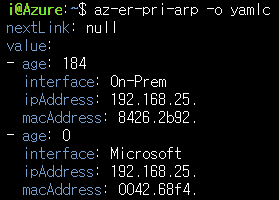

# az-cli-aliases

> $ cat ~/.bash_aliases
```
export AZ_SUB="~~~~~~"
export RG="koc-rg"
export ER="ko-er"
export KO_HUB="koc-vhub"
export KO_RT_ID="/subscriptions/${AZ_SUB}/resourceGroups/${RG}/providers/Microsoft.Network/virtualHubs/${HUB_KO}/hubRouteTables/defaultRouteTable"

alias so='source ~/.bash_aliases'

alias az-er-pri-arp='az network express-route list-arp-tables -n ${ER} --path primary --peering-name AzurePrivatePeering -g ${RG}'
alias az-er-pri-route='az network express-route list-route-tables -n ${ER} --path primary --peering-name AzurePrivatePeering -g ${RG}'
alias az-er-pri-route-sum='az network express-route list-route-tables-summary -n ${ER} --path primary --peering-name AzurePrivatePeering -g ${RG}'

alias az-er-sec-arp='az network express-route list-arp-tables -n ${ER} --path secondary --peering-name AzurePrivatePeering -g ${RG}'
alias az-er-sec-route='az network express-route list-route-tables -n ${ER} --path secondary --peering-name AzurePrivatePeering -g ${RG}'
alias az-er-sec-route-sum='az network express-route list-route-tables-summary -n ${ER} --path secondary --peering-name AzurePrivatePeering -g ${RG}'

alias az-hub-ko-route='az network vhub get-effective-routes --resource-type VpnConnection --resource-id ${KO_RT_ID} -n ${KO_HUB} -g ${RG} -o table | tail -n+3 | awk -F"/s" "{print \$1} END{print \"Total Routes:\",NR}"'
```

---
## az network express-route list-arp-tables
ExpressRoute 회로의 현재 ARP(주소 확인 프로토콜) 테이블을 표시합니다.
```
az network express-route list-arp-tables
    --path {primary, secondary}
    --peering-name
    [--ids]
    [--name or -n]
    [--resource-group or -g]
```

### 예제
```
az network express-route list-arp-tables \
    --path primary --peering-name AzurePrivatePeering \
    -n MyCircuit -g MyResourceGroup
```

### alias
```
export ER="ko-er"
export RG="ko-rg"

alias az-er-pri-arp='az network express-route list-arp-tables -n ${ER} --path primary --peering-name AzurePrivatePeering -g ${RG}'
```
### 스크린샷
> $ az-er-pri-arp



---
## az network express-route list-route-tables
ExpressRoute 회로 피어링의 현재 라우팅 테이블을 표시합니다.
```
az network express-route list-route-tables
    --path {primary, secondary}
    --peering-name
    [--ids]
    [--name or -n]
    [--resource-group or -g]
```

### 예제
```
az network express-route list-route-tables \
    --path primary --peering-name AzurePrivatePeering \
    -n MyCircuit -g MyResourceGroup
```

### alias
```
export ER="ko-er"
export RG="ko-rg"

alias az-er-pri-route='az network express-route list-route-tables -n ${ER} --path primary --peering-name AzurePrivatePeering -g ${RG}'
```
### 스크린샷
> $ az-er-pri-route


---
## az network express-route list-route-tables-summary
ExpressRoute 회로 피어링의 현재 라우팅 테이블 요약을 표시합니다.
```
az network express-route list-route-tables-summary
    --path {primary, secondary}
    --peering-name
    [--ids]
    [--name or -n]
    [--resource-group or -g]
```

### 예제
```
az network express-route list-route-tables-summary \
    --path primary --peering-name AzurePrivatePeering \
    -n MyCircuit -g MyResourceGroup
```

### alias
```
export ER="ko-er"
export RG="ko-rg"

alias az-er-pri-route-sum='az network express-route list-route-tables-summary -n ${ER} --path primary --peering-name AzurePrivatePeering -g ${RG}'
```
### 스크린샷
> $ az-er-pri-route-sum


---
## az network vhub get-effective-routes
가상 허브 리소스 또는 지정된 리소스에 대해 구성된 유효 경로를 가져옵니다.
```
az network vhub get-effective-routes 
    --name or -n
    --resource-group or -g
    [--no-wait]
    [--resource-id]
    [--resource-type]
```

### 예제
```
az network vhub get-effective-routes \
    --resource-type RouteTable \
    --resource-id /subscriptions/MySub/resourceGroups/MyRG/providers/Microsoft.Network/virtualHubs/MyHub/hubRouteTables/MyRouteTable \
    -n MyHub -g MyRG
```

### alias
```
export RG="ko-rg"         // Resource Group
export AZ_SUB="~~~~~~"    // Azure Subscriptions
export KO_HUB="koc-vhub"  // Virtual HUB
export KO_RT_ID="/subscriptions/${AZ_SUB}/resourceGroups/${RG}/providers/Microsoft.Network/virtualHubs/${HUB_KO}/hubRouteTables/defaultRouteTable"
                          // Virtual HUB defaultRouteTable ID

alias az-hub-ko-route='az network vhub get-effective-routes --resource-type VpnConnection --resource-id ${KO_RT_ID} -n ${KO_HUB} -g ${RG} -o table | tail -n+3 | awk -F"/s" "{print \$1} END{print \"Total Routes:\",NR}"'
```
설명
```
-o table : 열 제목인 키가 포함된 ASCII 테이블 형식으로 출력
tail -n+3 : 테이블 형식 출력 결과의 상위 3줄을 뺀 나머지 출력
awk -F"/s" : 출력 결과물을 "/s" 문자열 기준으로 앞과 뒤로 나눔.
{print \$1} : awk로 나뉜 결과물 중 앞 결과물만 표시. $1 앞에 역슬래쉬(\)를 넣은 이유는 alias문 때문
END{print \"Total Routes:\",NR} : 출력 마지막에 "Total Routes:" 문자열을 출력하고 라인수 합계를 표시. 라인수 = 라우팅 갯수
```
### 스크린샷
> $ az-hub-hk-route


